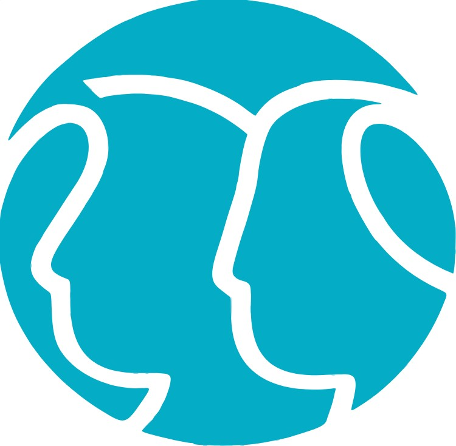
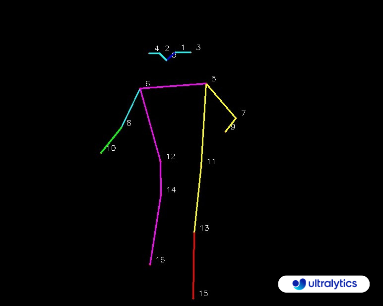

# VisiAge Fall Detection System
### By Caring Minds

This project is a Fall Detection System that utilizes computer vision techniques to detect falls in a video feed. The system integrates with Azure Blob Storage to store relevant information about the detected falls.

## Features

- **Real-time Fall Detection:** Utilizes the YOLO (You Only Look Once) model to analyze video frames and identify key points of a person, enabling real-time fall detection. The possible key points are as shown in the image below:
  
  
  
- **Azure Blob Storage Integration:** Stores information about detected falls, including timestamp, video blob name, and incident status, in Azure Blob Storage.
- **API Call to App Service:** Triggers an API call to an app service endpoint when a fall is detected, providing relevant information for further alerting and analysis.

## Setup

1. **Install Dependencies:**
   - Ensure you have Python installed.
   - Install required Python packages using `pip install -r requirements.txt`.

2. **Azure Blob Storage Configuration:**
   - Set up an Azure Storage account and create a container for storing fall information and video clips.
   - Update the `AZURE_STORAGE_CONNECTION_STRING` and `CONTAINER_NAME` variables in the code with your Azure Storage account details.

3. **Run the Code:**
   - Execute the code file `fall_detection.py` to start the fall detection system.
   - The system will process the video feed, detect falls, and upload relevant information to Azure Blob Storage.

## Configuration

- **Yolo Model:**
  - The YOLO model file (`yolov8n-pose.pt`) is expected to be in the `yolo models/` directory.
  - You can replace the model file or adjust its location as needed.

- **Thresholds and Parameters:**
  - Adjust falling thresholds, time thresholds, and other parameters as needed for your specific use case. These are defined in the code under the "DEFINING VARIABLES AND CONSTANTS FOR FALLING/LAYING DOWN" section. Only adjust the following variables:
    - `MIN_ELAPSED_TIME_THRESHOLD`
    - `VIDEO_FPS`

- **Frames Per Second (FPS):**
  - The current FPS is 10. This is what worked best with the webcam. The number of frames in the before and after clip is calculated as follows: number of seconds x FPS
  - Since the saved footage is a maximum of 10 seconds before the fall, it is 100 frames. And 15 seconds after (150 frames). This value is subject to change as you change the FPS.
  - The code uses `source=0` which is the webcam. To apply the model to a video or image, you can change the source to the path of the file in quotes. Be aware though, you would have to change the FPS and the before/after lengths to match your desired speed for the capturing of the video footage. It was tested with a 30 FPS video and worked when the value of `video_frames_before` was 300, and `video_frames_after` was 450.

## Important Notes

- Make sure to customize the API endpoint (`url` variable in the `send_api_call` function) to match the endpoint of your app service.

## License

YOLOv8 which is used in this system is the latest version of YOLO by Ultralytics. According to the Ultralytics Licensing page, YOLOv8 repositories, just like YOLOv3 and YOLOv5, comes with an AGPL-3.0 License for all users by default. If you aim to integrate Ultralytics software and AI models into commercial goods and services without adhering to the open-source requirements of AGPL-3.0, then their Enterprise License is what you’re looking for. See the page for more details about [Ultralytics legal terms of use](https://www.ultralytics.com/legal/terms-of-use).

## Acknowledgments

- This project utilizes the [Ultralytics YOLO](https://github.com/ultralytics/ultralytics/tree/main/ultralytics/cfg/models) model for pose estimation.
